# Veridian Payables

[](https://github.com/abdullahfullstackdev7/ap-invoice-automation/actions/workflows/ci.yml)


Accounts payable automation that reads supplier invoices, reconciles them against purchase orders and goods receipts, routes exceptions to the right approver, and schedules payment, with a full audit trail at every step.

> **Sample product.** Veridian Payables is a fictional product built to demonstrate a complete accounts payable platform end to end. Customer names and testimonials on the public site are illustrative.

---

## Overview

Accounts payable is one of the most manual corners of finance. Each supplier invoice must be read, checked against the purchase order that authorized it and the goods receipt that confirms delivery, approved by someone with the right authority, and paid on time, ideally early enough to capture any discount offered. Done by hand, this is slow, error-prone, and blind to the price drift, duplicate billing, and over-receipt that quietly cost organizations money.

Veridian Payables automates that workflow from end to end. Documents enter through a secure upload, are read with optical character recognition and deterministic extraction, and are matched line by line against procurement records. Clean invoices flow straight through. Everything else lands in a prioritized exception queue with the exact numeric variance attached. Approvals follow a configurable policy matrix that enforces segregation of duties, payments are scheduled against due dates and discount windows, and every state change is recorded in a tamper-evident audit log.

The platform is designed on one principle: **rules first, language models last**. Deterministic code handles the large majority of invoices. A small, budget-controlled language model call handles only the fields that rules cannot resolve. All money-moving decisions remain in auditable code, never in model output.

## Objectives

- **Eliminate manual reconciliation** for clean invoices, and focus human effort on the exceptions that genuinely need judgment.
- **Prevent leakage** by catching duplicate invoices, price variance, over-receipt, and short receipts before payment is released.
- **Enforce control** through role-based access, segregation of duties, approval limits, and an append-only audit log that auditors can verify independently.
- **Capture value** by scheduling payments on the due date, or earlier when an early-payment discount clears the organization's hurdle rate.
- **Provide evidence** through analytics that reconcile to the underlying records: cycle time, straight-through rate, exception trends, savings, and cash outflow.
- **Keep cost and risk low** with an LLM budget guard, a circuit breaker and provider failover, token-minimizing prompts, and no personal data sent to a model beyond the failing text region.

## What We Build

| Capability | Summary |
|---|---|
| **Secure intake** | Multi-file upload with magic-byte validation, size and page limits, randomized storage names, and SHA-256 exact-duplicate detection. |
| **Document understanding** | Text-layer detection for native PDFs, image preprocessing, RapidOCR with a Tesseract fallback, and layout-aware line reconstruction. |
| **Extraction and validation** | Anchor-based header extraction, column-clustered line items, vendor block parsing, and arithmetic, date, and confidence validation. |
| **LLM router** | Groq as primary and Gemini as secondary, failover on rate limits and timeouts, a circuit breaker, one schema-repair retry, and daily budget gating. |
| **Entity resolution** | Vendor matching by tax identifier, trigram similarity, and embedding similarity; purchase order matching; optimal invoice-to-PO line assignment. |
| **Three-way match engine** | Duplicate, header, quantity, price, totals, tax, and terms rules as pure functions, each returning a reason code and numeric evidence. |
| **Exception management** | SLA-timed queues by severity, default assignment by reason code, and eight resolution actions, all recorded in the audit log. |
| **Approval routing** | A policy matrix driven by amount and situation, with segregation of duties and approval limits enforced by the API. |
| **Payments** | Due-date and early-discount scheduling, maker-checker batch release, a simulated bank-file export, and settlement. |
| **Analytics** | Seventeen read endpoints with ETag caching and CSV export, plus a five-tab dashboard with global filters and comparison periods. |
| **Public site and login** | A marketing site with a real login flow, multi-factor authentication support, and a contact form backed by the API. |

## How It Helps

| Stakeholder | Outcome |
|---|---|
| **AP team** | Clean invoices never reach a desk. The team works one prioritized queue, with each exception already explained. |
| **Controllers** | Every number traces to a source record, and cycle time and aging are current rather than a month-end estimate. |
| **Procurement** | Price drift and over-receipt surface before payment, so negotiated terms are actually enforced. |
| **Treasury** | A 90-day outflow forecast and discount-capture visibility support cash planning. |
| **Internal audit** | Controls are enforced in code and evidenced by a hash-chained audit log that can be verified on demand. |
| **Leadership** | Straight-through rate, leakage prevented, and exception trends show whether the process is improving. |

---

## Architecture

The diagram shows the end-to-end workflow: how a document enters the platform, how the processing pipeline transforms it, how decisions and payments are made, and how data flows to analytics.

```mermaid
flowchart LR
    %% ============ USERS ============
    subgraph USERS["<b>Users and Roles</b>"]
        direction TB
        U1["<b>AP Clerk</b><br/>Upload and triage exceptions"]
        U2["<b>Approver</b><br/>Approve within limit"]
        U3["<b>Finance Manager</b><br/>Batches, analytics, policy"]
        U4["<b>Auditor</b><br/>Read-only evidence"]
    end

    %% ============ PRESENTATION ============
    subgraph UI["<b>Presentation Layer</b>"]
        FE["<b>React 19 SPA</b><br/>Public site, login, analytics dashboard"]
    end

    %% ============ API ============
    subgraph API["<b>API Layer: FastAPI /api/v1</b>"]
        direction TB
        GW["<b>REST Gateway</b><br/>HttpOnly JWT cookies, CSRF, rate limits"]
        RBAC["<b>RBAC and Segregation of Duties</b><br/>Deny by default"]
        AUD["<b>Audit Log</b><br/>Hash chained, append only"]
    end

    %% ============ INTAKE ============
    subgraph INTAKE["<b>1. Intake</b>"]
        direction TB
        UP["<b>Secure Upload</b><br/>Magic bytes, size and page limits"]
        DUP["<b>Exact Duplicate Check</b><br/>SHA-256 fingerprint"]
    end

    %% ============ PIPELINE ============
    subgraph PIPE["<b>2. Processing Pipeline</b><br/>Procrastinate worker queue on PostgreSQL"]
        direction TB
        OCR["<b>OCR</b><br/>RapidOCR, Tesseract fallback"]
        EXT["<b>Rules Extraction</b><br/>Anchors, columns, validation"]
        LLM["<b>LLM Router</b><br/>Groq primary, Gemini secondary"]
        ENT["<b>Entity Resolution</b><br/>Vendor, PO and line mapping"]
        MATCH["<b>3-Way Match Engine</b><br/>Invoice, purchase order, goods receipt"]
    end

    %% ============ DECISION ============
    subgraph DECIDE["<b>3. Decision and Payment</b>"]
        direction TB
        ROUTE{"<b>Match Outcome</b>"}
        AUTO["<b>Auto Approved</b><br/>Clean and within limit"]
        EXC["<b>Exception Queue</b><br/>SLA timers, reason codes"]
        APPR["<b>Approval Routing</b><br/>Policy matrix, SoD"]
        PAY["<b>Payment Scheduling</b><br/>Due date or early discount"]
        BATCH["<b>Payment Batch</b><br/>Maker and checker release"]
        SETTLE["<b>Settlement</b><br/>Simulated bank file"]
    end

    %% ============ DATA ============
    subgraph DATA["<b>Data Layer</b>"]
        direction TB
        PG[("<b>PostgreSQL 16</b><br/>pgvector, pg_trgm")]
        FS[("<b>File Storage</b><br/>Randomized names")]
        AN[("<b>analytics_daily</b><br/>Nightly rollup")]
    end

    %% ============ EXTERNAL ============
    subgraph EXTERNAL["<b>External Services</b>"]
        direction TB
        GROQ["<b>Groq API</b><br/>Text model, free tier"]
        GEM["<b>Gemini API</b><br/>Text and vision, free tier"]
        EMB["<b>fastembed</b><br/>Local embeddings, no API cost"]
    end

    %% ============ INSIGHT ============
    subgraph INSIGHT["<b>4. Insight</b>"]
        direction TB
        ANAPI["<b>Analytics API</b><br/>17 endpoints, ETag, CSV export"]
        DASH["<b>Analytics Dashboard</b><br/>Five tabs, global filters"]
    end

    %% ============ FLOWS ============
    U1 --> FE
    U2 --> FE
    U3 --> FE
    U4 --> FE
    FE -->|"HTTPS, cookies, CSRF header"| GW
    GW --> RBAC
    RBAC --> UP
    GW -.->|"every access and change"| AUD
    UP --> DUP
    DUP -->|"new document"| FS
    DUP -->|"enqueue process_invoice"| OCR
    OCR --> EXT
    EXT -->|"failing or low confidence fields only"| LLM
    LLM --> GROQ
    LLM --> GEM
    LLM -.->|"schema validated output"| EXT
    EXT --> ENT
    ENT --> EMB
    ENT --> MATCH
    MATCH --> ROUTE
    ROUTE -->|"clean, within limit"| AUTO
    ROUTE -->|"exception"| EXC
    ROUTE -->|"duplicate, blocked"| EXC
    EXC --> APPR
    APPR -->|"approved"| PAY
    APPR -->|"rejected"| EXC
    AUTO --> PAY
    PAY --> BATCH
    BATCH --> SETTLE
    SETTLE -->|"invoice marked paid"| PG
    PIPE -.->|"persist results and audit"| PG
    PG -.->|"nightly refresh"| AN
    AN --> ANAPI
    ANAPI --> DASH
    DASH --> FE

    %% ============ STYLING ============
    classDef user fill:#E8EEF9,stroke:#0B1F3A,stroke-width:2px,color:#0B1F3A,font-weight:bold
    classDef ui fill:#1F5EFF,stroke:#0B1F3A,stroke-width:2px,color:#FFFFFF,font-weight:bold
    classDef api fill:#0B1F3A,stroke:#0B1F3A,stroke-width:2px,color:#FFFFFF,font-weight:bold
    classDef intake fill:#EEF4FF,stroke:#1F5EFF,stroke-width:2px,color:#0B1F3A
    classDef pipe fill:#DCE7FF,stroke:#1F5EFF,stroke-width:2px,color:#0B1F3A
    classDef decide fill:#D9F5F2,stroke:#12B5A6,stroke-width:2px,color:#0B1F3A
    classDef exc fill:#FBE9EA,stroke:#B91C1C,stroke-width:2px,color:#7F1D1D,font-weight:bold
    classDef data fill:#F1F5F9,stroke:#475569,stroke-width:2px,color:#0F172A
    classDef ext fill:#FDF3DC,stroke:#B7791F,stroke-width:2px,color:#5C3B0E
    classDef insight fill:#EDE9FE,stroke:#7C3AED,stroke-width:2px,color:#2E1065

    class U1,U2,U3,U4 user
    class FE ui
    class GW,RBAC,AUD api
    class UP,DUP intake
    class OCR,EXT,ENT,MATCH,LLM pipe
    class ROUTE,AUTO,APPR,PAY,BATCH,SETTLE decide
    class EXC exc
    class PG,FS,AN data
    class GROQ,GEM,EMB ext
    class ANAPI,DASH insight

    style USERS fill:#FAFBFD,stroke:#94A3B8,stroke-dasharray:4 4
    style UI fill:#FAFBFD,stroke:#1F5EFF,stroke-width:2px
    style API fill:#F8FAFC,stroke:#0B1F3A,stroke-width:2px
    style INTAKE fill:#FAFCFF,stroke:#1F5EFF
    style PIPE fill:#F5F9FF,stroke:#1F5EFF,stroke-width:2px
    style DECIDE fill:#F4FCFB,stroke:#12B5A6,stroke-width:2px
    style DATA fill:#FAFBFC,stroke:#475569,stroke-width:2px
    style EXTERNAL fill:#FFFBF2,stroke:#B7791F,stroke-width:2px,stroke-dasharray:4 4
    style INSIGHT fill:#FAF8FF,stroke:#7C3AED,stroke-width:2px
```



### Component descriptions

| Layer | Component | Responsibility |
|---|---|---|
| Presentation | **React 19 SPA** (`frontend/`) | Public marketing site, login with MFA support, and the analytics dashboard. Built with Vite, Tailwind CSS v4, TanStack Query, and Apache ECharts. |
| API | **FastAPI** (`backend/app/api/`) | REST endpoints under `/api/v1`. Authentication, CSRF protection, rate limiting, RBAC dependencies, and request-scoped audit logging. |
| Intake | **Upload and duplicate detection** | Validates every file before it touches disk, stores it under a random name, and short-circuits exact duplicates. |
| Pipeline | **Worker tasks** (`backend/app/workers/`) | Each stage is a Procrastinate job chained to the next. Jobs are idempotent: a retry or duplicate enqueue is a no-op once the invoice has moved past its stage. |
| Pipeline | **Rules extraction and validation** | Deterministic extraction from OCR geometry, followed by arithmetic and confidence checks. |
| Pipeline | **LLM router** (`backend/app/llm/`) | Calls a model only for failing fields. Enforces per-provider rate and daily budgets, opens a circuit breaker on repeated failure, and validates every output against a schema. |
| Pipeline | **Entity resolution and matching** | Resolves vendors and purchase orders, maps lines, and runs the rules engine. Each rule returns a reason code and the numeric evidence behind it. |
| Decision | **Routing, exceptions, payments** | Applies the approval policy matrix, manages the exception workflow and SLAs, schedules payments, and runs batch release with segregation of duties. |
| Data | **PostgreSQL 16 with pgvector** | System of record. Three roles separate migration, runtime, and analytics access. `audit_log` is append-only at the database level. |
| Data | **Analytics rollup** | `analytics_daily` is refreshed nightly and after each payment batch settles, so hot dashboard queries stay fast. |
| External | **Groq, Gemini, fastembed** | Two free-tier language model providers for the fallback path, and a local embedding model with no API cost. |

### Key data flows

1. **Invoice to payment.** Upload, then OCR, extraction, entity resolution, and matching. A clean match within the auto-approve limit proceeds directly to payment scheduling. Any other result goes to the exception queue, where an approver or finance manager decides it.
2. **Duplicates.** An exact file duplicate is rejected at upload. An exact invoice duplicate (same vendor and invoice number) is persisted as a blocked record, so the decision is visible and auditable, never silently discarded.
3. **LLM use.** The rules extractor runs first. The model receives only the fields that failed, and its output is discarded unless it validates against the expected schema.
4. **Analytics.** Operational tables feed `analytics_daily` nightly. Dashboard endpoints read the rollup for speed, and drill-down reads the raw tables for accuracy.

### Architectural decisions

- **Rules over models.** Money-moving decisions are deterministic code. Language models are a fallback for extraction only.
- **PostgreSQL as the only stateful dependency.** The job queue, vector search, trigram matching, and audit log all run on Postgres, keeping the deployment to one database engine.
- **Append-only audit.** `app_rw` cannot update or delete `audit_log`. Each row stores a hash of the previous row, so tampering is detectable with `GET /api/v1/audit/verify`.
- **Decimal money everywhere.** Amounts are `Decimal` in Python and `NUMERIC` in the database. Floating-point arithmetic is not used for currency.
- **Pure rule functions.** Each matching rule takes an immutable context and returns findings, with no database access, so it can be tested in isolation and property-tested with Hypothesis.

---

## Technology Stack

| Area | Technology | Version | Purpose |
|---|---|---|---|
| Language | Python | 3.12 | Backend runtime |
| API framework | FastAPI | 0.115 or later | REST API and OpenAPI schema |
| ORM and migrations | SQLAlchemy (async), Alembic | 2.0 or later, 1.13 or later | Data access and schema versioning |
| Database | PostgreSQL with pgvector and pg_trgm | 16 | System of record, vector and fuzzy search |
| Job queue | Procrastinate | 3.10 or later | Postgres-backed background jobs and periodic tasks |
| Authentication | pwdlib (Argon2id), PyJWT, pyotp | pwdlib 0.2 or later, PyJWT 2.9 or later, pyotp 2.9 or later | Password hashing, tokens, TOTP MFA |
| OCR | RapidOCR (ONNX), Tesseract via pytesseract | rapidocr-onnxruntime 1.4 or later | Text recognition with fallback |
| Image and PDF | pdfplumber, pypdfium2, OpenCV, Pillow | Current | Text-layer detection, rendering, preprocessing |
| Matching | rapidfuzz, SciPy | rapidfuzz 3.10 or later, SciPy 1.14 or later | Fuzzy matching and optimal assignment |
| Embeddings | fastembed (BAAI/bge-small-en-v1.5) | 0.4 or later | Local vector embeddings, no API cost |
| LLM providers | Groq (OpenAI-compatible SDK), Google Gemini SDK | openai 1.52 or later, google-genai 0.3 or later | Fallback extraction, primary and secondary |
| Logging and rate limits | structlog, slowapi | structlog 24.4 or later | Structured logs with request identifiers |
| Frontend | React, TypeScript, Vite | React 19.2, TypeScript 6.0, Vite 8.3 | Single-page application |
| Styling | Tailwind CSS | 4.3 | Design system with tokens |
| Data and state | TanStack Query, TanStack Table, React Hook Form, Zod | Query 5.104, Table 9.2, Zod 4.6 | Server state, tables, forms, validation |
| Charts | Apache ECharts, echarts-for-react | ECharts 6.1 | Analytics visualizations |
| Testing | pytest, Hypothesis, schemathesis, Locust, Vitest, Playwright, axe-core | pytest 8.3, Vitest 5.0, Playwright 1.63 | Unit, property, contract, load, end-to-end, accessibility |
| Quality | Ruff, mypy (strict), Bandit, pip-audit, ESLint, Prettier | Ruff 0.7, mypy 1.13 | Lint, types, security, dependency audit |
| Packaging | Docker, Docker Compose, uv, npm | Compose v2 | Local stack and reproducible installs |
| CI | GitHub Actions | n/a | Long-dash check, Gitleaks, backend and frontend jobs, Docker builds |

Each dependency is governed by its own license. Review them before any distribution. The FATURA dataset license is covered in [Dataset](#dataset).

---

## Prerequisites

- **Docker** and **Docker Compose** for the database and the full stack
- **Python 3.12** and **[uv](https://docs.astral.sh/uv/)** for backend development and dataset scripts
- **Node.js 22** and **npm** for frontend development
- **Make** (optional), for the convenience targets in the `Makefile`

---

## Quick Start

```bash
git clone git@github.com:abdullahfullstackdev7/ap-invoice-automation.git
cd ap-invoice-automation

cp .env.example .env        # set real secrets locally; .env is never committed
make up                     # build and start the stack, then apply migrations
make seed                   # create the demo users and approval policies
```

Open the application:

| Surface | URL |
|---|---|
| Public site | http://localhost:5173 |
| Login | http://localhost:5173/login |
| Analytics (after login) | http://localhost:5173/analytics |
| API | http://localhost:8000/api/v1 |
| Interactive API docs | http://localhost:8000/docs (disabled when `APP_ENV=production`) |
| Health and readiness | `GET /api/v1/healthz`, `GET /api/v1/readyz` |

### Demo credentials

Created by `make seed` in a sample deployment. Each account uses the password set by `SEED_<ROLE>_PASSWORD`, defaulting to `ChangeMe123Demo!`. **Change these before exposing the deployment beyond a local sandbox.**

| Role | Email | Approval limit |
|---|---|---|
| Admin | `admin@veridianpayables.demo` | None (administration only) |
| AP Clerk | `clerk@veridianpayables.demo` | 2,500 |
| Approver | `approver@veridianpayables.demo` | 25,000 |
| Finance Manager | `manager@veridianpayables.demo` | Unlimited within policy |
| Auditor | `auditor@veridianpayables.demo` | Read only |

### Loading data

The synthetic dataset is produced by the `dataset/` pipeline and loaded with `make load-data` once `dataset/synthetic/*.csv` exists. See [Dataset](#dataset).

---

## Screenshots

Screenshots of the dashboard, the three-way comparison screen, and the analytics tabs are part of the planned documentation (Plan.md section 9). They have not been captured yet. The public site uses CSS-built visuals because no external image service was reachable during development; see `docs/image-credits.md`.

---

## Core Workflow

| Stage | Trigger | Output | Status |
|---|---|---|---|
| 1. Upload | `POST /api/v1/invoices/upload` | Document and invoice record, `uploaded` | Implemented |
| 2. OCR | `process_invoice` job | Words and lines, `ocr_done` | Implemented |
| 3. Extraction | `extract_invoice_fields` job | Header and line fields with confidence, `extracted` or `needs_review` | Implemented |
| 4. Entity resolution | `resolve_invoice_entities` job | Vendor, PO, and line mapping, or `VENDOR_UNRESOLVED` | Implemented |
| 5. Match | `match_invoice` job | Outcome: `AUTO_APPROVED`, `EXCEPTION`, or `BLOCKED` | Implemented |
| 6. Route | `route_invoice` job | Automatic approval, or a required approver role | Implemented |
| 7. Approve | Approval decision or exception action | `approved` or `needs_review` | Implemented |
| 8. Pay | `schedule_payment`, then batch create and release | `scheduled`, `released`, `settled`, invoice `paid` | Implemented |
| 9. Report | Nightly and post-batch refresh | Dashboard and CSV exports | Implemented |

---

## Key Features

### Document intake and OCR

- Validation by magic bytes, not file extension. Limits: 15 MB per file and 20 pages.
- Exact duplicates are detected by SHA-256 before any storage write or OCR job.
- Native PDFs with a text layer skip OCR. Other documents are rendered, preprocessed, and read by RapidOCR, with Tesseract as a fallback when confidence is low.

### Extraction and validation

- Header fields are extracted by label proximity over OCR geometry. Line items are assigned to columns by x-position clustering.
- Arithmetic checks use a tolerance of 0.02. Fields below a 0.8 confidence threshold are flagged.

### LLM router

- Primary provider Groq, secondary Gemini (the only vision-capable option).
- Failover on 429, 5xx, or timeout, with one same-provider retry first.
- Two consecutive failures open a 60-second circuit breaker for that provider.
- One repair retry on schema failure, then escalation to the next provider.
- Daily requests are capped at 90 percent of the configured quota. Every attempt is logged to `llm_usage`.

### Entity resolution

- Vendors: exact tax identifier, then trigram similarity, then embedding similarity. A match needs a score of at least 0.90 and a margin of at least 0.05 over the runner-up. Otherwise the invoice is left for review.
- Purchase orders: exact PO number match first, then candidate scoring within a 120-day window.
- Lines: exact SKU first, then a globally optimal assignment (Hungarian algorithm) over combined description and fuzzy scores.

### Three-way match engine

Rules run in order over an immutable snapshot. Each returns zero or more exceptions with a reason code, severity, and evidence. See [Matching rules and reason codes](#matching-rules-and-reason-codes).

### Exception management

- Statuses: `open`, `in_review`, `resolved`, `escalated`.
- SLA timers by severity: high 4 hours, medium one business day, low three days.
- Actions: approve with a mandatory reason, reject, request credit note, request corrected invoice, hold, reassign, add comment, re-match.
- Re-match is idempotent: a late-arriving purchase order or receipt never duplicates an open exception.

### Approval routing

Driven by the `approval_policies` table, with a built-in fallback matrix. See [Roles and permissions](#roles-and-permissions) for the approval matrix.

### Payments

- Pay on the due date, or earlier when the early-payment discount's annualized return clears the hurdle rate (default 10 percent).
- Batches are created by a finance manager and released by a different finance manager.
- A bank-style CSV is generated per batch. No bank connection is made.

### Analytics

Seventeen read endpoints under `/api/v1/analytics/*`, and a five-tab dashboard: Executive, Operations, Vendors, Savings and Cash, and Platform. Global filters cover date presets, vendor, category, and a previous-period comparison. Tables export to CSV, and the page prints cleanly.

### Public website and authentication

- A marketing site with a Platform mega menu, role-based solution pages, resource articles, and a contact form stored through the API.
- Login with email and password, an MFA step when enabled, and a demo-access panel controlled by `VITE_DEMO_MODE`.

---

## Security and Governance

### Authentication

- Argon2id password hashing and a password policy of at least 12 characters.
- 15-minute access tokens and 7-day rotating refresh tokens, stored hashed. Both are delivered as `HttpOnly`, `SameSite=Strict` cookies.
- Replaying a rotated refresh token revokes the whole session family.
- Lockout after five failed logins, with exponential backoff.
- Optional TOTP multi-factor authentication for admin and approver roles.

### Authorization

- Deny by default. Every endpoint declares its roles with a `require_role` dependency. Amount-based authority is checked with `require_limit` against the approval limit on the user record.
- Object-level checks apply to every resource identifier.

### Segregation of duties

- The user who uploaded an invoice cannot approve it.
- The user who created a payment batch cannot release it.
- Vendor bank detail changes are designed to require a second user (planned for the vendor administration screens).

### Audit and evidence

- Every login, logout, denial, approval, exception action, policy change, and payment action writes an audit entry.
- Entries are hash-chained. `app_rw` has no UPDATE or DELETE on `audit_log`, enforced by the database.
- The chain is verifiable with `make verify-audit` or `GET /api/v1/audit/verify`.

### Platform protections

- Double-submit CSRF tokens on every state-changing request.
- Request body size limits, security headers, and per-IP rate limits.
- Vendor bank account numbers are encrypted at rest.
- Randomized storage names, so uploaded filenames are never used on disk.

### Data handling and AI

- Deterministic extraction handles most invoices with no model call.
- When a model is used, only the failing text region is sent, the model has no tools, and its output must match a schema. Output that does not match is discarded.
- Matching, routing, and payment decisions are never made by a model.

---

## Roles and Permissions

| Capability | Admin | AP Clerk | Approver | Finance Manager | Auditor |
|---|:---:|:---:|:---:|:---:|:---:|
| Upload invoices | Yes | Yes | No | No | No |
| Edit extracted invoice fields | Yes | Yes | No | No | No |
| View invoices, exceptions, vendors, purchase orders | Yes | Yes | Yes | Yes | Yes |
| Work exceptions (actions) | Yes | Yes | Yes | Yes | No |
| Approve within the approval matrix | No | Up to 2,500, with reason | Up to 25,000 | Above 25,000 | No |
| Create and release payment batches | No | No | No | Yes (not the same person) | No |
| Download bank files | Yes | No | No | Yes | Yes |
| Manage users and roles | Yes | No | No | No | Read only |
| Manage tolerance and approval policies | Yes | No | Read only | Read only | Read only |
| View analytics | Yes | No | No | Yes | Yes |
| LLM settings and test call | Yes | No | No | View only | No |
| View audit log and verify chain | Yes | No | No | No | Yes |
| Bulk assign exceptions | Yes | Yes | Yes | Yes | No |

The default approval matrix (configurable in `approval_policies`):

| Situation | Amount | Approver |
|---|---|---|
| Clean match | Up to 5,000 | Automatic |
| Clean match | Above 5,000 | Approver |
| Exception | Up to 2,500 | AP Clerk, with a reason |
| Exception | Up to 25,000 | Approver |
| Exception | Above 25,000 | Finance Manager |
| Duplicate suspected | Any | Approver, then Finance Manager |

---

## Matching Rules and Reason Codes

### Tolerance policy

Policies resolve in order: vendor, then category, then global. When nothing is configured, the defaults below apply.

| Check | Default | Outcome |
|---|---|---|
| Price | Within the greater of 1 percent or 1 currency unit | Pass |
| Price | Above tolerance, up to 5 percent | Low severity exception |
| Price | Above 5 percent | Medium severity exception |
| Vendor price history | Drift above 10 percent from the six-month average | Low severity exception |
| Quantity | Invoiced quantity above received minus previously invoiced | Exception |
| Totals | Recomputed total differs by more than 0.02 | Exception |
| Near-duplicate | Invoice number similarity of at least 0.85, amount within 0.5 percent, dates within 7 days | Duplicate suspected |

### Reason code glossary

| Reason code | Meaning | Typical severity |
|---|---|---|
| `DUPLICATE_EXACT` | Same vendor and invoice number already exists. Blocks payment. | High |
| `DUPLICATE_SUSPECTED` | A similar invoice was found. Routes to a two-step approval. | Medium |
| `PO_NOT_FOUND` | No purchase order matches the reference. Blocks payment. | High |
| `PO_CLOSED` | The referenced purchase order is closed. Blocks payment. | High |
| `VENDOR_MISMATCH` | Invoice vendor differs from the purchase order vendor. Blocks payment. | High |
| `VENDOR_UNRESOLVED` | No vendor matches with enough confidence. | Medium |
| `CURRENCY_MISMATCH` | Invoice currency differs from the purchase order. | Medium |
| `INVOICE_DATE_BEFORE_PO` | Invoice is dated before the purchase order. | Medium |
| `QTY_NOT_RECEIVED` | Invoiced quantity has no goods receipt. | High |
| `QTY_OVER_RECEIVED` | Invoiced quantity exceeds what has been received. | Medium |
| `PRICE_VARIANCE` | Unit price differs from the purchase order or vendor history. | Low or medium |
| `TOTAL_MISMATCH` | Line sum, subtotal, or total does not reconcile. | Medium |
| `TAX_INCONSISTENT` | Tax rate differs from the vendor's history. | Low |
| `DUE_DATE_MISMATCH` | Due date differs from the vendor's payment terms. | Low |

The outcome is `BLOCKED` if any blocking code is present, `EXCEPTION` if any other code is present, and `AUTO_APPROVED` when none are.

---

## Analytics KPI Definitions

Full definitions, including the early-payment formula and known limitations, are in [`docs/analytics.md`](docs/analytics.md). In summary:

| KPI | Definition |
|---|---|
| Straight-through rate (STP) | Auto-approved invoices divided by invoices processed in the period |
| Exception rate | Exceptions opened divided by invoices processed. Counted per exception, not per invoice |
| Cycle time | Hours from intake to payment release, for paid invoices |
| Leakage prevented | Dollar value of overpayment avoided on resolved price, quantity, and total exceptions, read from the match engine's own evidence |
| Discounts captured and missed | Early-payment discount value taken, and value missed because payment was scheduled on or after the due date |
| Aging | Outstanding payments bucketed by days past due: 0 to 30, 31 to 60, 61 to 90, and over 90 |

---

## API Overview

The full schema is served at `/docs` outside production. The main groups are:

| Group | Prefix | Highlights |
|---|---|---|
| Authentication | `/api/v1/auth` | Login, MFA verification, refresh, logout, current user, password change |
| Users | `/api/v1/users` | List, create, update, MFA enrollment, assignable users |
| Invoices | `/api/v1/invoices` | Upload, filtered list, detail, edit, match result, document download |
| Exceptions | `/api/v1/exceptions` | Filtered list, detail, actions, bulk assignment |
| Approvals | `/api/v1/invoices/{id}/approvals` | Approval history and decision |
| Vendors | `/api/v1/vendors` | List and detail with spend, exception rate, and price history |
| Procurement | `/api/v1/purchase-orders`, `/api/v1/goods-receipts` | List and detail with lines, receipts, and linked invoices |
| Payments | `/api/v1/payments` | Schedule, batch create, batch file, release |
| Policies | `/api/v1/policies` | Tolerance and approval policies (admin writes) |
| Analytics | `/api/v1/analytics` | Seventeen read endpoints with ETag caching and CSV export |
| Settings | `/api/v1/settings/llm` | Provider configuration, usage against quotas, test call |
| Audit | `/api/v1/audit` | Log listing and chain verification |
| Contact | `/api/v1/contact` | Public contact form |
| System | `/api/v1/healthz`, `/api/v1/readyz` | Liveness and readiness |

Errors use RFC 7807 problem responses. Database unavailability returns `503`, not `500`.

---

## Configuration Reference

All configuration comes from environment variables. Copy `.env.example` to `.env`, and change every `change_me` value before use outside a local sandbox.

### Application and database

| Variable | Default | Meaning |
|---|---|---|
| `APP_ENV` | `development` | `development`, `test`, or `production`. Production disables the API docs. |
| `DATABASE_URL` | `postgresql+psycopg://app_rw:change_me@db:5432/apdb` | Runtime connection for the API and worker |
| `DATABASE_ADMIN_URL` | `postgresql+psycopg://apdb_admin:change_me_admin@db:5432/apdb` | Migrations only |
| `DATABASE_RO_URL` | `postgresql+psycopg://app_ro:change_me_ro@db:5432/apdb` | Read-only analytics connection |
| `DB_APP_RW_PASSWORD` | `change_me` | Password for the `app_rw` role created by migrations |
| `DB_APP_RO_PASSWORD` | `change_me_ro` | Password for the `app_ro` role created by migrations |

### Security and sessions

| Variable | Default | Meaning |
|---|---|---|
| `JWT_SECRET` | placeholder | Signing key, at least 32 characters. Must be replaced in production. |
| `ACCESS_TOKEN_MINUTES` | `15` | Lifetime of the access cookie |
| `REFRESH_TOKEN_DAYS` | `7` | Lifetime of the refresh cookie |
| `COOKIE_SECURE` | `false` | Set `true` behind HTTPS |
| `CORS_ORIGINS` | `http://localhost:5173` | Comma-separated allowed origins |
| `FIELD_ENCRYPTION_KEY` | `change_me` | Key for encrypting vendor bank account numbers |
| `FILE_STORAGE_PATH` | `/data/files` | Directory for uploaded documents |
| `MAX_UPLOAD_MB` | `15` | Maximum size of one upload |

### Language models

| Variable | Default | Meaning |
|---|---|---|
| `LLM_PRIMARY` | `groq` | First provider tried for text tasks |
| `LLM_SECONDARY` | `gemini` | Fallback provider, and the only vision option |
| `GROQ_API_KEY` | empty | Groq key. Leave empty to disable Groq. |
| `GROQ_MODEL` | `openai/gpt-oss-20b` | Groq model name |
| `GROQ_RPM` / `GROQ_TPM` / `GROQ_RPD` | `30` / `8000` / `1000` | Requests per minute, tokens per minute, requests per day |
| `GEMINI_API_KEY` | empty | Gemini key. Leave empty to disable Gemini. |
| `GEMINI_MODEL` | `gemini-2.5-flash-lite` | Gemini model name |
| `GEMINI_RPM` / `GEMINI_TPM` / `GEMINI_RPD` | `10` / `250000` / `200` | Gemini quotas |
| `LLM_DAILY_BUDGET_STOP_PCT` | `90` | Stop calling a provider at this percent of its daily quota |
| `LLM_MAX_TOKENS_HEADER` | `250` | Output limit for header extraction |
| `LLM_MAX_TOKENS_LINES` | `600` | Output limit for line-item extraction |

When neither key is set, the pipeline runs rules-only, and invoices that rules cannot resolve go to `needs_review`.

### Processing and policy

| Variable | Default | Meaning |
|---|---|---|
| `EMBEDDING_MODEL` | `BAAI/bge-small-en-v1.5` | Local embedding model, downloaded on first use |
| `OCR_ENGINE` | `rapidocr` | `rapidocr` or `tesseract` |
| `AUTO_APPROVE_LIMIT` | `5000` | Clean matches at or below this amount skip human approval |
| `EARLY_PAY_DISCOUNT_HURDLE_PCT` | `10.0` | Minimum annualized return for taking an early-payment discount |
| `DEMO_MODE` | `true` | Enables demo-only conveniences such as seeded accounts |

### Frontend and tooling

| Variable | Default | Meaning |
|---|---|---|
| `VITE_API_BASE_URL` | `http://localhost:8000/api/v1` | API base URL used by the frontend |
| `VITE_DEMO_MODE` | `true` | Shows the demo-access panel on the login page |
| `PLAYWRIGHT_PORT` | `5173` | Port used by the end-to-end suite's dev server |
| `SEED_<ROLE>_PASSWORD` | `ChangeMe123Demo!` | Password for each seeded demo account |
| `TEST_DATABASE_URL` / `TEST_DATABASE_ADMIN_URL` | local port 5433 | Database used by the backend test suite |
| `LOAD_TEST_EMAIL` / `LOAD_TEST_PASSWORD` | demo clerk | Account used by the load test |

---

## LLM Setup

Both providers offer free tiers, which is what the default quotas assume.

1. **Groq:** create an API key at https://console.groq.com and set `GROQ_API_KEY`.
2. **Gemini:** create an API key at https://aistudio.google.com/apikey and set `GEMINI_API_KEY`.
3. Restart the API and worker. Confirm both providers in the Settings screen, or with the LLM test call (`POST /api/v1/settings/llm/test-call`, admin only).

**How switching works.** `LLM_PRIMARY` is tried first. Failures on 429, 5xx, or timeouts trigger one retry, then a switch to `LLM_SECONDARY`. A provider that fails twice in a row is skipped for 60 seconds, or for the period its `retry-after` header specifies.

**How tokens are saved.** Extraction runs rules first, so most invoices use no model at all. When a model is needed, it receives only the failing fields and a short prompt, with output capped by `LLM_MAX_TOKENS_*`. Results are cached by a hash of the normalized OCR text, so the same document is never sent twice.

**How quotas are enforced.** Per-minute and per-day limits are tracked in process and in `llm_usage`. Calls stop at `LLM_DAILY_BUDGET_STOP_PCT` of the daily quota, and the invoice is marked `needs_review` instead of failing.

---

## Dataset

The invoice images come from **FATURA**, a multi-layout invoice image dataset of 10,000 invoices across 50 templates.

- **Source:** Zenodo, DOI 10.5281/zenodo.10371464 (`FATURA2.zip`, 690.7 MB).
- **License:** CC BY 4.0.
- **Citation:** Limam, Dhiaf, Kessentini. "FATURA: A Multi-Layout Invoice Image Dataset for Document Analysis and Understanding," 2023.

Purchase orders, goods receipts, payment history, and injected match anomalies are generated synthetically from the FATURA ground truth. Full provenance, rebuild steps, and validation are in [`dataset/README.md`](dataset/README.md).

```bash
make dataset                 # download, inspect, build truth, generate linked data, validate
make load-data               # load the synthetic dataset into the database
```

---

## Evaluation Results

Full results, method, and caveats are in [`docs/evaluation.md`](docs/evaluation.md).

| Area | Result | Basis |
|---|---|---|
| Backend line coverage | 81.3 percent | Target 80 percent |
| Matching engine coverage | 95.5 percent | Target 95 percent |
| API contract fuzzing | 68 of 68 operations, no 5xx | schemathesis, 25 examples per operation |
| Load: 50 concurrent users, reads | 4,165 requests, 0 failures, median 720 ms | Shared Windows development machine |
| Load: 10 concurrent uploads | 283 uploads, 0 failures, median 87 ms | Shared Windows development machine |
| Accessibility, public routes | Zero serious or critical axe-core violations | 18 Playwright tests |
| Extraction and OCR accuracy | Pending FATURA-scale evaluation | Synthetic smoke tests only |

The OCR bake-off, extraction accuracy by template, and the matching confusion matrix against the full evaluation set have not been produced yet. The reports are scripted (`make evaluate-extraction`, `make evaluate-matching`, `make ocr-bakeoff`) and run once the dataset is available.

---

## Testing

```bash
# Backend: unit, integration, property-based, and contract tests
cd backend && uv run pytest
make contract-test                    # schema fuzzing against every operation
make coverage                         # enforces the coverage gates

# Frontend
cd frontend && npm run test           # Vitest unit and component tests
cd frontend && npm run test:e2e       # Playwright end-to-end and accessibility scans

# Load (requires a running API)
make loadtest

# Static checks and security
make lint
make typecheck
make security-audit
```

The backend suite needs the database from Docker Compose, which listens on port 5433. The end-to-end suite starts its own dev server. If port 5173 is taken, set `PLAYWRIGHT_PORT`.

---

## Deployment and Backup

**Local and demo deployment** uses Docker Compose: `make up` builds the API, worker, web, and database services, then applies migrations. Health is checked at `/api/v1/readyz`.

**Production considerations** that are not yet implemented:

- A reverse proxy with TLS termination (Caddy or Nginx), `COOKIE_SECURE=true`, and a strict `CORS_ORIGINS` list.
- Separate secrets for `JWT_SECRET`, `FIELD_ENCRYPTION_KEY`, and each database role.
- A managed PostgreSQL instance with point-in-time recovery, in place of the compose database.
- Horizontal scaling of the worker. Jobs are safe to retry because each stage is idempotent.

**Backup today** is a logical dump of the database and the document volume:

```bash
docker compose exec db pg_dump -U apdb_admin -d apdb > backup_$(date +%F).sql
docker run --rm -v ap-invoice-automation_files_data:/data -v "$PWD":/backup alpine tar czf /backup/files_$(date +%F).tar.gz -C /data .
```

A scheduled backup job and a tested restore procedure are part of the runbook, which is planned but not yet written.

---

## Troubleshooting

| Symptom | Likely cause | Resolution |
|---|---|---|
| `password authentication failed for user "app_rw"` | `DATABASE_URL` points at a different Postgres, often on port 5432 while the compose database is on 5433 | Point `DATABASE_URL` at the compose database, or change the compose port mapping |
| `Psycopg cannot use the 'ProactorEventLoop'` on Windows | The default Windows event loop is incompatible with the async Postgres driver | Run the API with `asyncio.WindowsSelectorEventLoopPolicy`, or use WSL or Linux |
| Login returns `429 Too Many Requests` | Login is limited to 10 attempts per minute per IP | Wait a minute. The limit is intentional |
| LLM calls return 429 | The provider's per-minute or per-day quota is exhausted | Check `GET /api/v1/settings/llm`. Invoices fall back to rules or `needs_review` |
| Dataset download stalls | The Zenodo archive is large, and transfers can drop | Re-run `dataset/download_fatura.sh`. It resumes and verifies the MD5 checksum |
| Tesseract is not found | The system binary is not installed | Install `tesseract-ocr`, or set `OCR_ENGINE=rapidocr` |
| Playwright cannot bind port 5173 | Another process holds the port | Set `PLAYWRIGHT_PORT` to a free port |
| Migration fails on a missing role | Migrations ran without `DATABASE_ADMIN_URL` | Run migrations as `apdb_admin` using `DATABASE_ADMIN_URL` |
| `/readyz` returns 503 | The database is unreachable or rejecting the connection | Check `docker compose ps db` and the database URL |

---

## Project Structure

```
ap-invoice-automation/
├── README.md
├── Plan.md                    Phase-by-phase delivery plan
├── Makefile                   Convenience targets for every workflow
├── docker-compose.yml         db, api, worker, web, clamav
├── .env.example               Every configuration variable with defaults
├── docs/                      Analytics KPIs, evaluation report, image credits
├── dataset/                   FATURA download, synthetic generator, validation
├── backend/
│   ├── app/
│   │   ├── api/               REST routers
│   │   ├── analytics/         Refresh job and query layer
│   │   ├── core/              Settings, security, errors, middleware
│   │   ├── db/                Engine and session factory
│   │   ├── extraction/        Rules extractor and validator
│   │   ├── llm/               Router, providers, budgets
│   │   ├── matching/          Rules, engine, duplicate detection, policies
│   │   ├── models/            SQLAlchemy models
│   │   ├── ocr/               Preprocessing and OCR engines
│   │   ├── schemas/           Pydantic request and response models
│   │   ├── services/          Audit, routing, payments, notifications
│   │   └── workers/           Procrastinate task pipeline
│   ├── alembic/               Migrations
│   ├── loadtest/              Locust scenarios
│   ├── scripts/               Seed, evaluation, verification
│   └── tests/                 Unit, integration, property, and contract tests
└── frontend/
    ├── e2e/                   Playwright end-to-end and accessibility tests
    └── src/
        ├── app/               Routing and providers
        ├── components/        Design system, layout, analytics, charts
        ├── lib/               API client, hooks, content, formatting
        └── pages/             Public site, login, analytics
```

---

## Roadmap and Status

| Phase | Scope | Status |
|---|---|---|
| 0 | Foundation: repository, Docker, CI, dataset scaffold | Complete |
| 1 | Dataset acquisition and synthetic linked data | Complete; full FATURA download pending |
| 2 | Database schema, migrations, role separation | Complete |
| 3 | Authentication and authorization | Complete |
| 4 | Document intake and OCR | Complete |
| 5 | Extraction, validation, LLM router | Complete |
| 6 | Embeddings and entity resolution | Complete |
| 7 | Three-way match and rules engine | Complete |
| 8 | Exceptions, approval routing, payment release | Complete |
| 9 | Analytics backend | Complete |
| 10 | Public website and login | Complete |
| 11 | Authenticated application | Backend complete; frontend pages pending |
| 12 | Analytics dashboard | Complete |
| 13 | Quality, evaluation, hardening | Gates met; Trivy, ZAP, and crash-recovery testing outstanding |
| 14 | Packaging, demo, documentation | In progress (demo script and runbook planned) |

### Known limitations

- **Authenticated frontend pages.** The invoice list and detail, exception queue, three-way resolution screen, approvals, payments, vendors, and settings have backend endpoints, but their screens are not built yet.
- **Real-scale evaluation.** Accuracy and performance have been measured on synthetic data and a shared development machine. Results on the full FATURA evaluation set are pending.
- **Bank integration.** Payment files are simulated. No bank connection exists.
- **Screenshots and demo script.** Not yet captured.
- **Lighthouse.** The public site's Lighthouse scores have not been measured.

### Environment notes

This project was developed in a sandbox with restricted outbound network access. Large downloads were throttled, and some container images could not finish building. Each affected step is documented where it applies, and the code paths involved were verified directly where the environment allowed.

---

## Project Ground Rules

- **Money is `Decimal`.** Floating-point arithmetic is not used for currency, in Python or in SQL.
- **No long dash.** The character U+2014 does not appear anywhere in the repository. CI enforces this.
- **Secrets stay out of git.** `.env` and local verification files are ignored. CI runs Gitleaks.
- **Every phase ends with passing tests and an updated README.**

## Contributing

1. Create a branch from `main`.
2. Make the change, with tests. Backend changes must pass `make lint`, `make typecheck`, and the backend test suite. Frontend changes must pass `npm run lint`, `npm run typecheck`, and `npm run test`.
3. Write commits in the conventional style used in this repository: `feat:`, `fix:`, `docs:`, `test:`, or `refactor:`, followed by a short description of the reason for the change.
4. Open a pull request against `main` with a summary and the test evidence.

**Code style.** Python is formatted and linted with Ruff at a 100-character line length, and type-checked with mypy in strict mode. TypeScript is linted with ESLint and formatted with Prettier. Comments explain non-obvious reasons only.

---

## License and Attributions

- **Project license:** not yet selected. No license file is included, so the code is not open for reuse until one is added.
- **FATURA dataset:** CC BY 4.0. Credit Limam, Dhiaf, and Kessentini (2023). See [Dataset](#dataset).
- **Third-party packages:** each dependency is governed by its own license. Review them before distribution.
- **Imagery:** no external images are used. Visuals are CSS and SVG constructions described in `docs/image-credits.md`.
- **Icons:** Lucide icons, as bundled through the `lucide-react` package.
